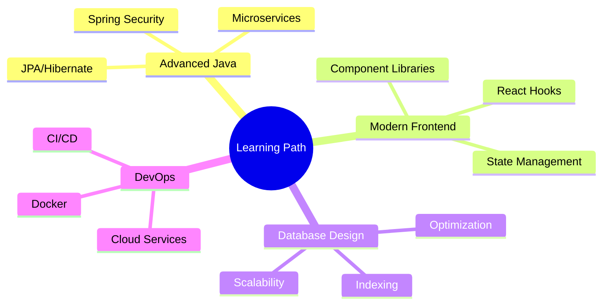

# 👋 Hi there, I'm Thanandorn Boonchot!

  

  
  
  

---

## 🚀 About Me

> *"I'm an undergraduate student passionate about technology and software development. With a foundation in both backend and frontend, I enjoy building efficient, scalable, and user-friendly applications. I’m eager to keep learning new tools and frameworks to grow as a full-stack developer and create solutions that make a real impact"*

🎓 Status: College student (undergraduate)

🤝 Traits: Curious, creative thinker, Friendly , good communicator, adaptable

🚀 Aspiring: Software Engineer / Full-Stack Developer 

---

## 💻 Tech Stack

### **Languages**

### **Frontend**

### **Backend**

### **Database**

---

## 🌱 Currently Learning

- 🔥 **Advanced Java & Spring Ecosystem** - Diving deeper into enterprise-level development
- ⚛️ **Modern Frontend with React** - Building responsive and interactive user interfaces  
- 🗄️ **Scalable Database Design** - Learning optimization and best practices
- ☁️ **Cloud Technologies** - Exploring deployment and scalability solutions

---

## 🏆 Featured Projects

### 🏨 Thanachok Dormitory Booking and Management Web Application
**A comprehensive web-based solution for dormitory management and booking system**

**Key Features:** 
- Online dormitory booking system
- Student and admin management panels  
- Room availability tracking
- Booking history and reports
- User-friendly interface design

**Technologies Used:** Java, Spring Framework, Web Development Technologies

*This project demonstrates my ability to create full-stack applications that solve real-world problems in accommodation management.*

---

## 📱 Connect With Me

---

  
  ### 💫 *"Code is like humor. When you have to explain it, it's bad."* 
  
  **Thanks for visiting my profile!**  
  *Feel free to connect, collaborate, or just say hi! 🚀*
  

